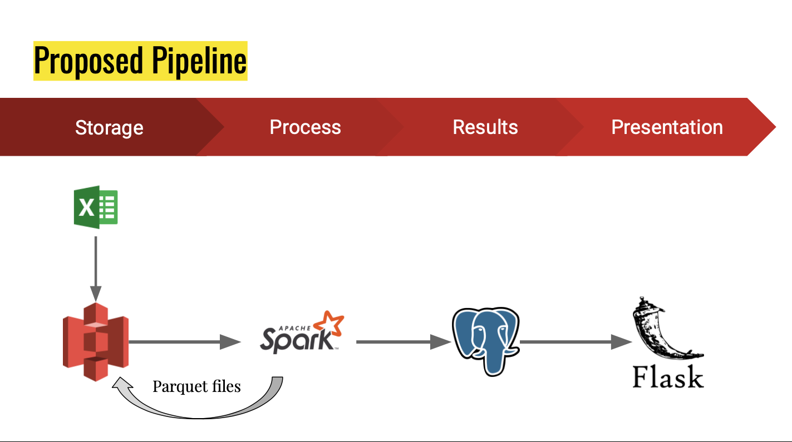
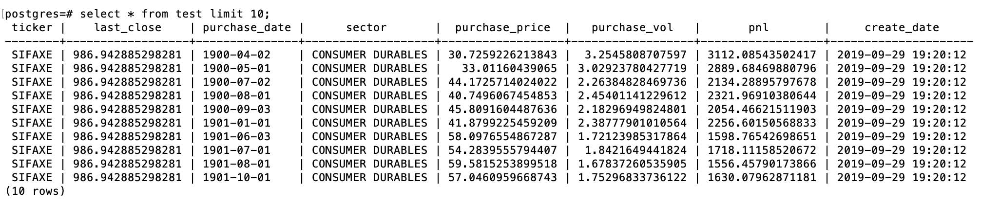
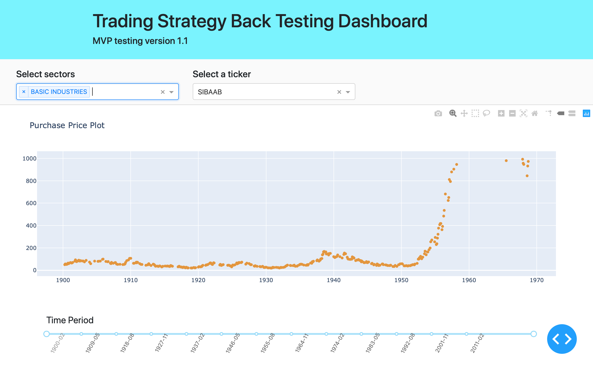
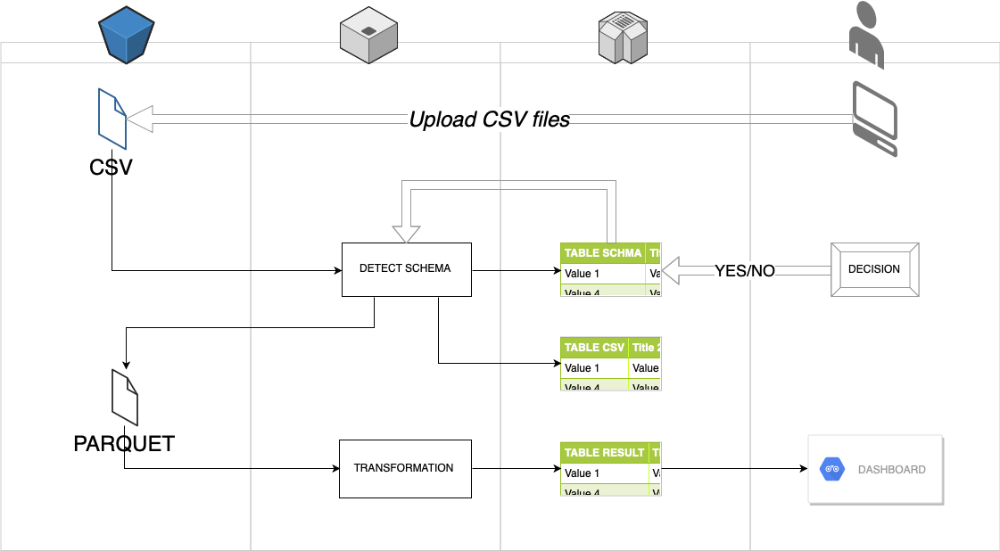

# Back In Time

## Table of Contents

1. [Motivation](#motivation)
2. [Overview](#overview)
3. [Dataset](#dataset)
4. [Conversion](#conversion)
5. [Transformation](#transformation)
6. [Database](#database)
7. [Visualization](#visualization)
8. [Vision](#vision)
9. [Notes](#notes-on-setting-the-environment)

## Motivation
In my previous jobs, I have seen the same problems with data management over and over again, 
across different countries and industries. Often, employees work on Excel files 
and save them in their local machine or shared drive on a daily basis. 
Over a period time and possibly several rounds of staff turn-overs,
the daily files become unmanageable. Besides security and cost concerns, 
it is almost impossible to use those historical data efficiently. 

To address this ubiquitous problem, I build a pipeline that will help companies bettter manage their historical data, 
so the security, cost and efficiency issues could be addressed properly.


## Overview
The main focus of this project is to build a pipeline from raw csv files to a cloud storage to data processing to a database and 
finally to the consumer through a user interface. 



Therefore, following along the pipeline, I demonstrate how to migrate large amount of csv files of different sizes, 
close to 2000 csv files and about 437GB in total, to AWS S3 bucket; 
converting cvs files into parquet files which to be stored in S3 bucket; performing a naive trading strategy with the whole dataset and 
export the results to a Postgres database. Finally, a DASH front end was built for the user to interact with the results in database.

The structure of the directory is mapped according to this tree:
```
backtesting
    |- cli
        |- useful.sh
    |- comparison
        |-
    |- dash
        |- app_dash.py
    |- db
        |- schema.sql
    |- simulation
        |- GBM.py
        |- merton_jump.py
        |- dates_generator.py
        |- price_generator_final.py
    |- spark
        |- api_18080.py
        |- connect_s3.py
        |- create_table.py
        |- field_detector.py
        |- file_convertor.py
        |- strategy.py
```


## Dataset
Arguably the most common business use case for this project would be that companies have accumulated 
many different sizes of files and most likely time series data that need to be aggregated for further consumption.
In order to fully test out this scenario, I simulated the following files and stored them in S3 buckets. 

|Number of csv files|Size of csv file (MB)|
|---|---|
|1,251|70|
|500|140|
|200|350|
|100|700|
|100|1,400|

Each file contains pseudo daily historical stock prices generated from Merton's jump diffusion model, 
with a 6-digit ticker, from year 1900 to 2019, across 12 sectors. 

**Why csv files?**
Since MS Excel is [arguably the most important computer program in workplace around](https://www.investopedia.com/articles/personal-finance/032415/importance-excel-business.asp) the world, 
focusing on how to handle large amount of different sizes of csv files seems to be a sensible choice.


## Conversion
1. ```file_convertor.py``` reads in the csv files from S3 bucket and write to S3 bucket as parquet files.
2. ```field_detector.py``` infers the header types from the csv file, translates the spark data types to postgres types (works with some most used types), 
and stores those in a Postgres table. Another function in the file automatically create a table in database and insert the 
csv data into the table. 

**Why parquet files?**
1. Fast in reading which is appropriate in this case, since writing is only an one-off task while reading is much more frequent.
2. Columnar format which is suitable for time-series data.
3. Spark SQL faster with large parquet files.
4. Parquet with compression reduces data storage cost and disk IO which reduces input data needs.

Testing results show that reading in many csv files are much slower than reading in one parquet file of the same size.
It seems to be a good choice, to convert many csv files into one large parquet file at once to greatly enhance the performance.
After conversion, 70G of csv files will be compressed to a 40G parquet file.

## Transformation
The defined naïve trading strategy goes as follows: for each beginning of the month, choose to buy 100 dollar worth of a stock
if the price of the 7-day moving average is less than the previous day closing price. Profit and Loss (PnL) for each trade is simply calculated 
from the multiplication of the volume and the difference of the last price of the period for each stock and the purchase price.
Finally, for each stock each day if there is a purchase, the purchase price, volume, last price and PnL will be
saved in a table in Postgres Database.  100 dollar and 7-day are variables arbitrarily chosen for simplicity.

After tuning the spark job, processing each 40G parquet file takes 17-21 mins on a spark cluster of 1 master and 3 workers on m4.Large EC2 instances.

## Database
Sample of the result table.



To enhance the performance, the table is indexed by three columns, namely ticker, sector and purchase_date.

## Visualization
Multiple choices drop down of sectors determines the drop down list of the tickers.
Range slider for the time period and the PnL for each ticker, each day are interactive thanks for Dash in Flask.



## Vision

Plan for futher development to make this product more user friendly and tech-light for the user.

Starting from the web UI, user choose the CSV files to be uploaded to S3. The inferred schema then will be presented to user for confirmation.
User could make changes by choosing the right types if the suggested ones are inappropriate. Then the final type got used in the process.
After processing the predefined analysis/transformation, user will be able to interact with the results from Web UI. 

Further development could introduce even greater flexibility of choices of databases, scheduled batch run to store csv files or reports, 
possibilities to define transformations using SQL etc...

## Notes on setting the environment

1. Following this [pegasus](https://blog.insightdatascience.com/how-to-get-hadoop-and-spark-up-and-running-on-aws-7a1b0ab55459) 
instruction to start a spark cluster on EC2 instances. In this case, there are 3 workers and 1 master all on m4.large 
with Ubuntu 16.04 images.
2. Install all the necessary packages according to requirements.txt.
3. Configure for Spark History Server. 
    - Useful [link](https://www.ibm.com/support/knowledgecenter/en/SS3MQL_1.1.1/management_sym/spark_configuring_history_service.html)
     on how to configure spark history server.
        
    - Modify spark-defaults.conf file under directory /usr/local/spark/conf. In this case, a folder called spark-events is created under /tmp/
    that will be used for storage of the history logs.
        ```
        spark.eventLog.enabled         true
        spark.eventLog.dir             file:///tmp/spark-events
        spark.history.fs.logDirectory  file:///tmp/spark-events
        ```
    - Start the spark service
        ```
        $cd /usr/local/spark/sbin/ && sudo ./start-history-server.sh
        ```
    - If it is a success, you should see this on your screen:
        ```
        starting org.apache.spark.deploy.history.HistoryServer, logging to /usr/local/spark/logs/spark-root-org.apache.spark.deploy.history.HistoryServer-1-ip-10-0-0-6.out
        ```
    - And now WebUI with port 18080 should work.
4. Configure for connecting to Postgres Database, in this case hosted in another m4.Large EC2 instance, 16.04 Ubuntu image.

    - Two conf files need to be changed on the server(10 is the Postgres version): 
        ```/etc/postgresql/10/main/pg_hba.conf``` and ```/etc/postgresql/10/main/postgresql.conf```
    - In pg_hba.conf file, (use sudo) go to the very end of the file. Add this line
    ```host    all             all              10.0.0.1/24            md5```
    where ```10.0.0.x``` is the private DNS address of my compute EC2 instances
    - In ```postgresql.conf``` file, go to Connection Settings. Change the listening address to: 
    ```listen_addresses = '*'```
    - Restart your postgresql: ```$sudo service postgresql start```
    
    - Check the status again:  ```$sudo service postgresql status```
5. Run Spark 
```
export PYSPARK_PYTHON=python3;
export SPARK_CLASSPATH= <path to downloaded jar>/postgresql-42.2.8.jar

pyspark
spark-submit --driver-class-path <path to downloaded jar>/postgresql-42.2.8.jar  <file_name>.py
```

6. Run Dash on Server
    - Install Python3, psycopg2, flask, dash, gunicorn and pandas
    - If not under root user ```export PATH=/home/ubuntu/.local/bin:/usr/local/sbin:/usr/local/bin:/usr/sbin:/usr/bin:/sbin:/bin```
    - Under root user run ```gunicorn -b 0.0.0.0:80 -w 4 -t 120 app_dash:server```